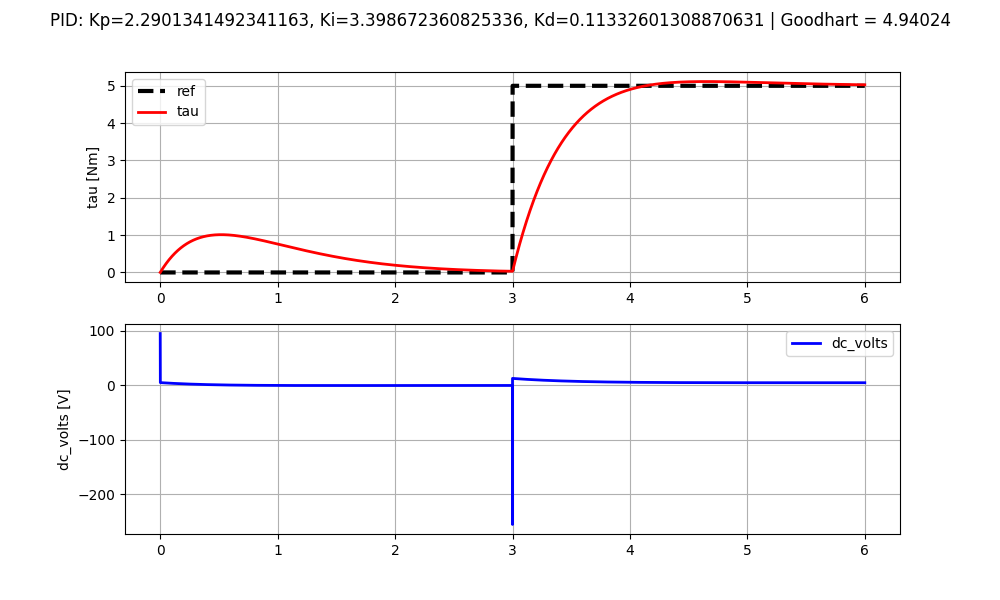
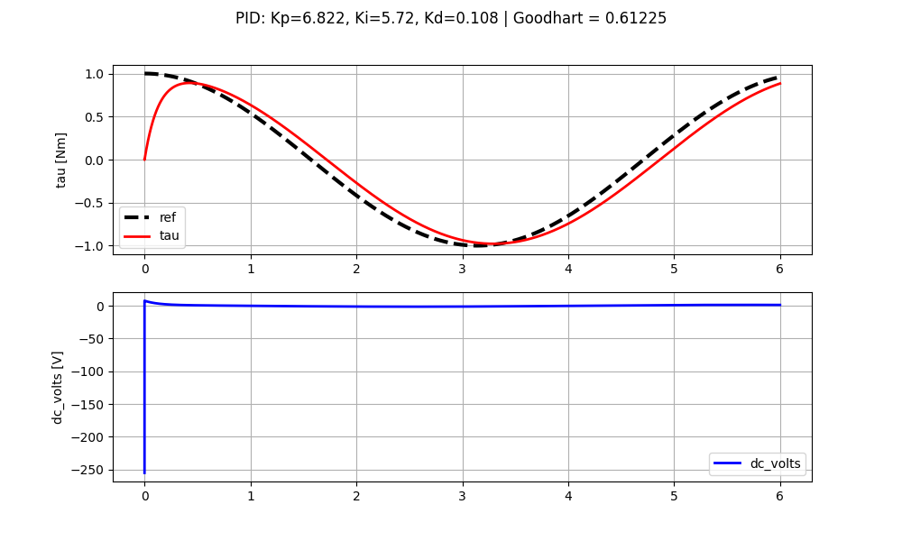
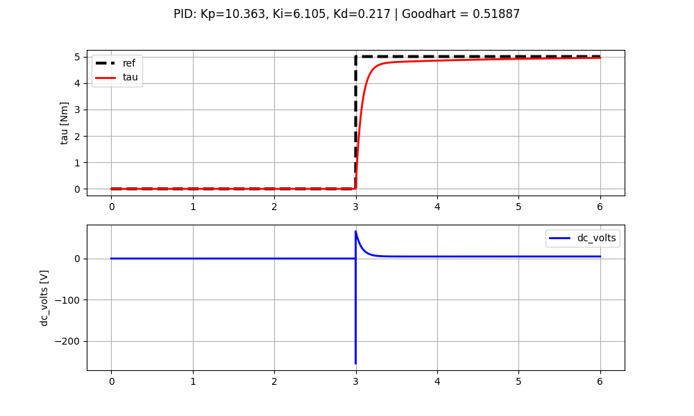
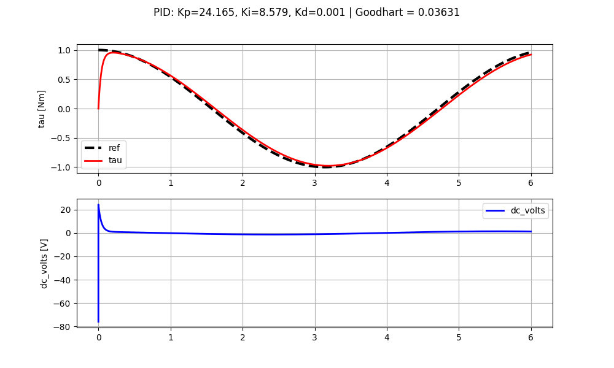
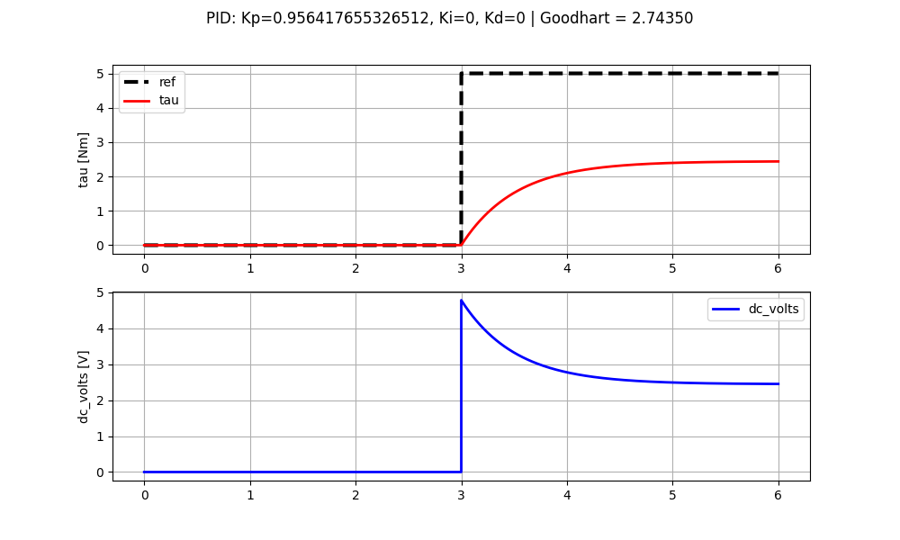
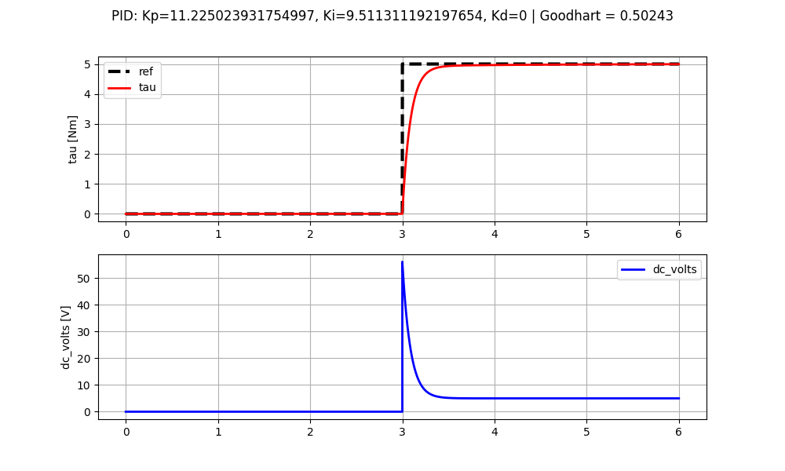
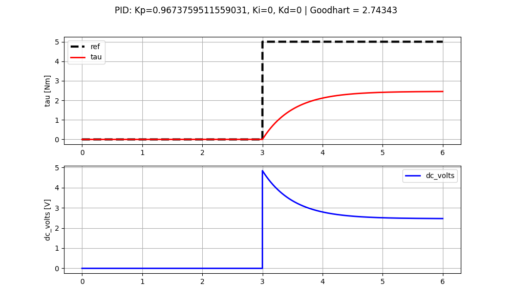
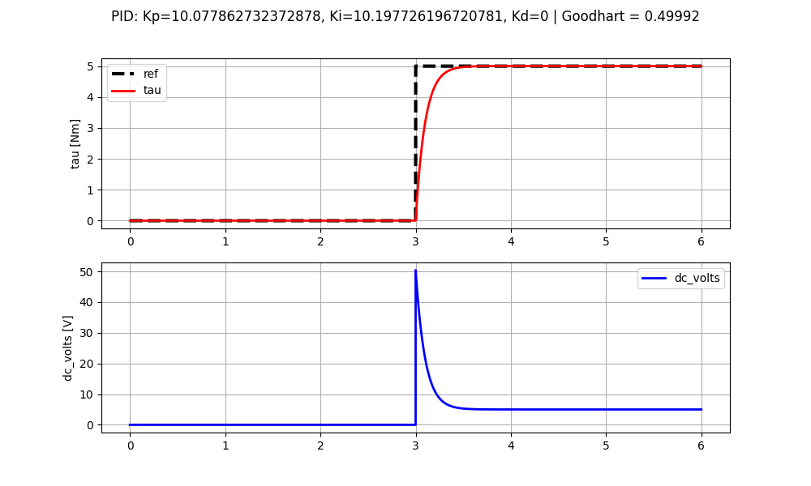

# Sistemas de Controle Inteligentes

Todo os algoritmos de sintonia inteligente do controlador irão utilizar como índice de desempenho do controlador o índice Goodhart, especificado abaixo.

# Índice de Desempenho de Controlador: Goodhart

## Visão Geral

O Índice de Goodhart avalia a qualidade da **ação de controle** ($SC_k$) e o erro resultante no sistema. Diferente de índices simples (como o MSE), ele permite ponderar se o controlador está sendo muito agressivo, se está desgastando o atuador ou se está consumindo energia excessiva.

## Formulação Matemática

O índice é calculado como uma soma ponderada:

$$Goodhart = c_1 \epsilon_1 + c_2 \epsilon_2 + c_3 \epsilon_3$$

Onde os componentes representam:

### 1. Nível Médio de Saída ($\epsilon_1$)
$$\epsilon_1 = \frac{1}{N} \sum_{k=1}^{N} SC_k$$
* **O que é:** A média da saída do controlador ($SC_k$).
* **Impacto:** Avalia o consumo médio de energia ou o "esforço constante" do atuador.

### 2. Variabilidade da Saída ($\epsilon_2$)
$$\epsilon_2 = \frac{1}{N} \sum_{k=1}^{N} (SC_k - \epsilon_1)^2$$
* **O que é:** A variância da ação de controle.
* **Impacto:** Avalia a estabilidade da saída. Valores altos indicam "jitter" (oscilações bruscas), que podem causar desgaste mecânico prematuro em válvulas ou motores.

### 3. Erro Residual ($\epsilon_3$)
$$\epsilon_3 = \frac{1}{N} \sum_{k=1}^{N} e_k^2$$
* **O que é:** O Erro Quadrático Médio (MSE) entre o setpoint e a variável de processo.
* **Impacto:** Garante que o sistema atinja o objetivo. É o indicador de eficácia do controle.

---

## Parametrização dos Ganhos

Os pesos $c_1, c_2, c_3$ definem a "personalidade" do seu controlador:

| Ganho | Foco Principal | Uso Recomendado |
| :--- | :--- | :--- |
| **$c_1$** | Economia | Quando o custo de operação/combustível é a restrição principal. |
| **$c_2$** | Suavidade | Quando se deseja evitar desgaste mecânico e ruído acústico. |
| **$c_3$** | Performance | Quando a precisão do rastreamento é crítica, ignorando o custo da saída. |

---

Em código isso pode ser definido durante a criação do objeto `pid_auto_tunning.PIDAutoTunning`, por exemplo no arquivo: `nelder_mead.py`, no campo **goodhart_gains**:

c1 = 0.33
c2 = 0.33
c3 = 0.34

O sintonizador irá priorizar igualmente os 3 ganhos

```python
auto_tunning = pid_auto_tunning.PIDAutoTunning(dc_motor_model, goodhart_gains=[0.33, 0.33, 0.34])
parcial_result = auto_tunning.tunning(initial_set, False)
parcial_result = sorted(parcial_result, key=lambda x: x[1])
```

# Nelder Mead 

## Goodhart Gains: (c1 = 0.33, c2 = 0.33, c3 = 0.34)

### Setpoint: Degrau
* Tempo de simulação: 905.119 segundos
* Saturação do controlador: [-255, +255]

<p align="center">
  
</p>

```bash
Tempo total de execução: 905.119 segundos
Optimization successful: False
Message: Maximum number of function evaluations has been exceeded.
Optimal parameters (x): [2.29013415 3.39867236 0.11332601]
Minimum function value (fun): 4.94023816763706
Number of function evaluations (nfev): 120
```

### Setpoint: Cosseno
* Tempo de simulação: 928.324 segundos
* Saturação do controlador: [-255, +255]

<p align="center">
  
</p>


```bash
Tempo total de execução: 928.324 segundos
Optimization successful: False
Message: Maximum number of function evaluations has been exceeded.
Optimal parameters (x): [6.822 5.72  0.108]
Minimum function value (fun): 0.6122521618514098
Number of function evaluations (nfev): 120
```


## Goodhart Gains: (c1 = 0.01, c2 = 0.01, c3 =0.98)

### Setpoint: Degrau
* Tempo de simulação: 342.475 segundos
* Saturação do controlador: [-255, +255]

<p align="center">
  
</p>

```bash
Tempo total de execução: 342.475 segundos
Optimization successful: True
Message: Optimization terminated successfully.
Optimal parameters (x): [10.363  6.105  0.217]
Minimum function value (fun): 0.518869366657457
Number of function evaluations (nfev): 46
```

## Setpoint: Cosseno
* Tempo de simulação: 
* Saturação do controlador: [-255, +255]

<p align="center">
  
</p>

```bash
Tempo total de execução: 343.944 segundos
Optimization successful: True
Message: Optimization terminated successfully.
Optimal parameters (x): [2.4165e+01 8.5790e+00 1.0000e-03]
Minimum function value (fun): 0.03630833284472987
Number of function evaluations (nfev): 47
```

# Algorítmo Genético

## Goodhart Gains: (c1 = 0.33, c2 = 0.33, c3 = 0.34)

### Setpoint: Degrau
* Tempo de simulação: 392.336 segundos
* Saturação do controlador: [-255, +255]

<p align="center">
  
</p>

```bash
Tempo total de execução: 392.336 segundos
Melhor solução encontrada:
Kp = 0.956417655326512
Ki = 0
Kd = 0
Custo = 2.7434976882164004
```

## Goodhart Gains: (c1 = 0.01, c2 = 0.01, c3 = 0.98)

### Setpoint: Degrau
* Tempo de simulação: 168.229 segundos
* Saturação do controlador: [-255, +255]

<p align="center">
  
</p>

```bash
Tempo total de execução: 168.229 segundos
Melhor solução encontrada:
Kp = 11.225023931754997
Ki = 9.511311192197654
Kd = 0
Custo = 0.50242851747384
```

# Algorítmo PSO

## Goodhart Gains: (c1 = 0.33, c2 = 0.33, c3 = 0.34)

### Setpoint: Degrau
* Tempo de simulação: 
* Saturação do controlador: [-255, +255]

<p align="center">
  
</p>

```bash
Tempo total de execução: 765.576 segundos
Melhor solução encontrada:
Kp = 0.9674
Ki = 0.0000
Kd = 0.0000

Custo = 2.743434
```

## Goodhart Gains: (c1 = 0.01, c2 = 0.01, c3 = 0.98)

### Setpoint: Degrau
* Tempo de simulação:
* Saturação do controlador: [-255, +255]

<p align="center">
  
</p>

```bash
Tempo total de execução: 1484.252 segundos
Melhor solução encontrada:
Kp = 10.0779
Ki = 10.1977
Kd = 0
Custo = 0.499923
```
